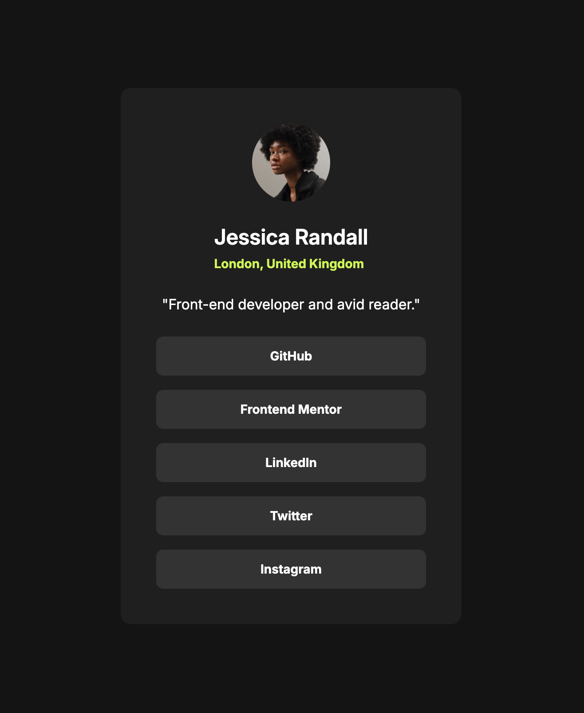

# Frontend Mentor - Social links profile solution

This is a solution to the [Social links profile challenge on Frontend Mentor](https://www.frontendmentor.io/challenges/social-links-profile-UG32l9m6dQ). Frontend Mentor challenges help you improve your coding skills by building realistic projects.

## Table of contents

- [Overview](#overview)
  - [The challenge](#the-challenge)
  - [Screenshot](#screenshot)
  - [Links](#links)
- [My process](#my-process)
  - [Built with](#built-with)
  - [What I learned](#what-i-learned)
- [Author](#author)

**Note: Delete this note and update the table of contents based on what sections you keep.**

## Overview

### The challenge

Users should be able to:

- See hover and focus states for all interactive elements on the page

### Screenshot

### Links

- Repository: [https://github.com/acandael/social-links-profile](https://github.com/acandael/social-links-profile)
- Live Site URL: [https://acandael-social-links-profile.netlify.app/src/index.html](https://acandael-social-links-profile.netlify.app/src/index.html)

## My process

First I setup TailwindCSS and extended with custom colors and Inter font, then I added the html structure and finally I styled it with Tailwind

### Built with

- Semantic HTML5 markup
- TailwindCSS
- Flexbox
- CSS Grid

**Note: These are just examples. Delete this note and replace the list above with your own choices**

### What I learned

I learned how to setup tailwind and deploy to Netlify

## Author

- Website - [https://www.webmoov.be](https://www.webmoov.be)
- Frontend Mentor - [@acandael](https://www.frontendmentor.io/profile/acandael)
- Twitter - [@acandael](https://www.twitter.com/acandael)
